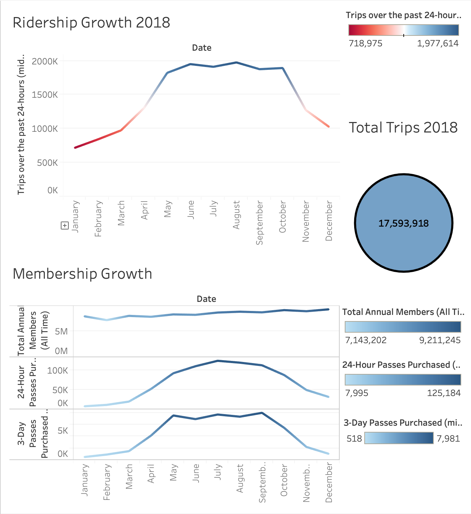
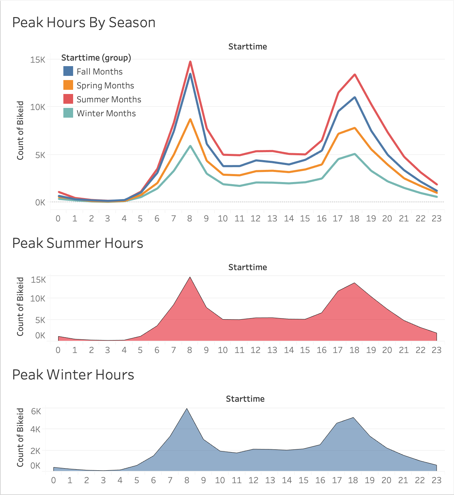
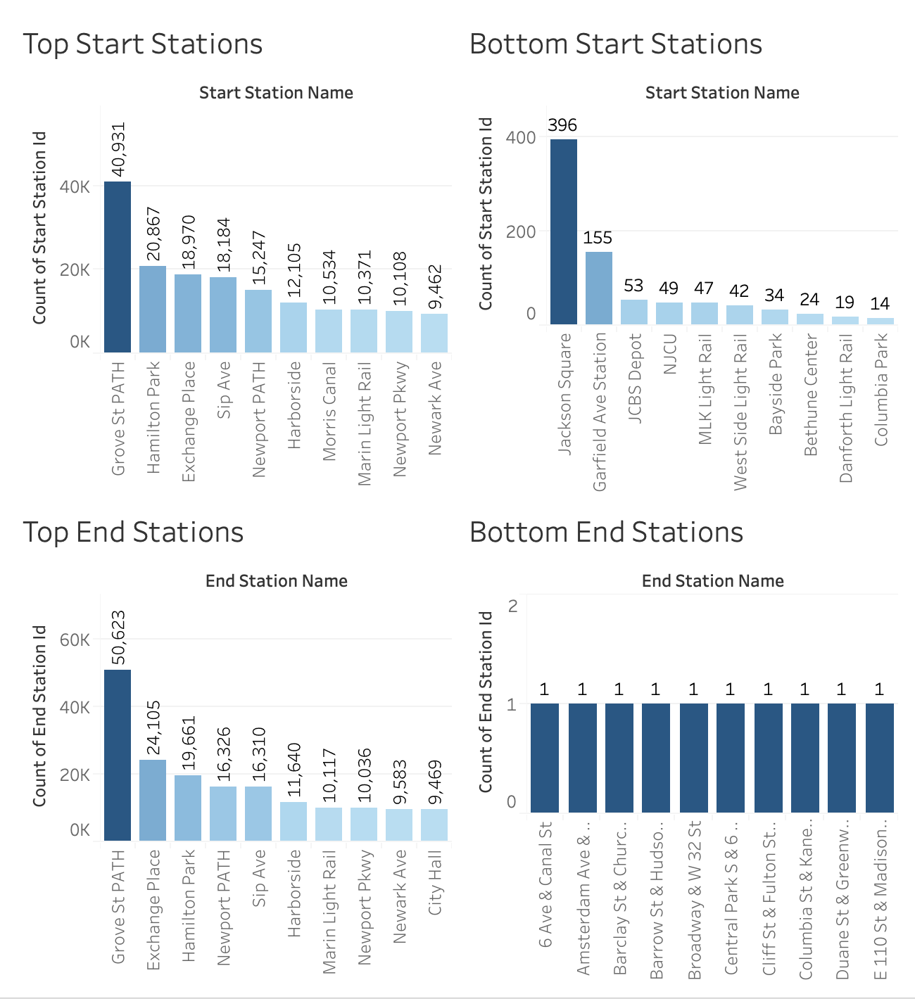
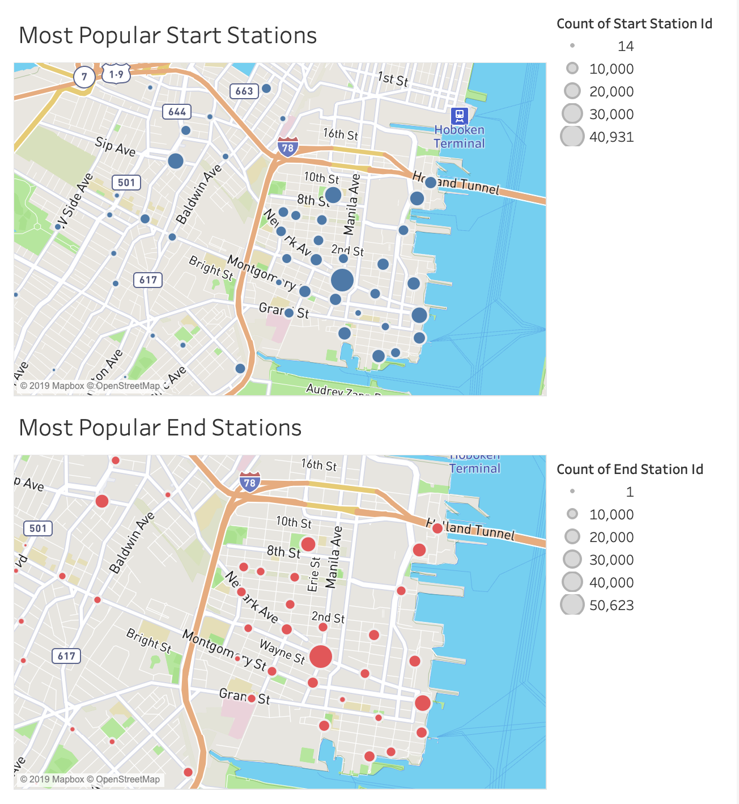

# Citi-Bike-Analytics

  <a href="#data-source">Data Source</a> •
  <a href="#findings">Findings</a> •
  <a href="#technology-Used">Technology Used</a>

Analysis of the New York Citi Bike Program, which oversees the largest bike sharing program in the United States.
Python and Tableau are utilized to create visualizations to identify trends and report back to city officials.
 
* Click [here](https://public.tableau.com/profile/sam.wimberly#!/vizhome/citibike-analysis_15645924526980/Maps) to view complted dashboard

## Utilization

There were 17,593,918 rides taken on Citi Bikes in New York City in 2018. Riders are much more likely to take a Citi Bike during the warmer, summer months than they are during the colder, winter months, as is displayed in the dashboard above. Short-term customer passes (3-day or 24 hour) follow the same overall seasonal trend, but annaul membership continues to trend in a positive direction regardless of season.

## Peak Hours

Upon closer investigation, we find that peak hours follow the same trend regardless of season. Citi Bike usage peaks at 8am and then again at 6pm, suggesting that Citi Bikes are utilized by day-time employees. Citi Bikes are utilized more often during summer and fall when outdoor temperatures are most comfortable. It is somewhat surprsing that city bike use during the spring is not as popular as summer or fall. This could be due to cool temperatures carrying into the spring. 

## Station Popularity

## Data Source

This [Citi Bike Data](https://www.citibikenyc.com/system-data) has been processed to remove trips that are taken by staff as they service and inspect the system and any trips that were below 60 seconds in length 
(potentially false starts or users trying to re-dock a bike to ensure it's secure).

<table class="hide-while-loading table table-striped">
<tbody id="tbody-content">
<thead>
<tr>
<th>Name</th>
<th>Date Modified</th>
<th>Size</th>
<th>Type</th>
</tr>
</thead>
<tr>
<td>&nbsp;<a href="https://s3.amazonaws.com/tripdata/JC-201801-citibike-tripdata.csv.zip">JC-201801-citibike-tripdata.csv.zip</a></td>
<td>Sep 6th 2018, 02:44:38 pm</td>
<td>328 KB</td>
<td>ZIP file</td>
</tr>
<tr>
<td>&nbsp;<a href="https://s3.amazonaws.com/tripdata/JC-201802-citibike-tripdata.csv.zip">JC-201802-citibike-tripdata.csv.zip</a></td>
<td>Sep 6th 2018, 02:44:38 pm</td>
<td>389 KB</td>
<td>ZIP file</td>
</tr>
<tr>
<td>&nbsp;<a href="https://s3.amazonaws.com/tripdata/JC-201803-citibike-tripdata.csv.zip">JC-201703-citibike-tripdata.csv.zip</a></td>
<td>Sep 6th 2018, 02:44:39 pm</td>
<td>443 KB</td>
<td>ZIP file</td>
</tr>
<tr>
<td>&nbsp;<a href="https://s3.amazonaws.com/tripdata/JC-201804-citibike-tripdata.csv.zip">JC-201804-citibike-tripdata.csv.zip</a></td>
<td>Sep 6th 2018, 02:44:39 pm</td>
<td>614 KB</td>
<td>ZIP file</td>
</tr>
<tr>
<td>&nbsp;<a href="https://s3.amazonaws.com/tripdata/JC-201805-citibike-tripdata.csv.zip">JC-201805-citibike-tripdata.csv.zip</a></td>
<td>Sep 6th 2018, 02:44:40 pm</td>
<td>888 KB</td>
<td>ZIP file</td>
</tr>
<tr>
<td>&nbsp;<a href="https://s3.amazonaws.com/tripdata/JC-201806-citibike-tripdata.csv.zip">JC-201806-citibike-tripdata.csv.zip</a></td>
<td>Sep 6th 2018, 02:44:40 pm</td>
<td>1.08 MB</td>
<td>ZIP file</td>
</tr>
<tr>
<td>&nbsp;<a href="https://s3.amazonaws.com/tripdata/JC-201807-citibike-tripdata.csv.zip">JC-201807-citibike-tripdata.csv.zip</a></td>
<td>Sep 6th 2018, 02:44:41 pm</td>
<td>1.11 MB</td>
<td>ZIP file</td>
</tr>
<tr>
<td>&nbsp;<a href="https://s3.amazonaws.com/tripdata/JC-201808%20citibike-tripdata.csv.zip">JC-201808 citibike-tripdata.csv.zip</a></td>
<td>Sep 12th 2018, 02:58:07 pm</td>
<td>1.17 MB</td>
<td>ZIP file</td>
</tr>
<tr>
<td>&nbsp;<a href="https://s3.amazonaws.com/tripdata/JC-201809-citibike-tripdata.csv.zip">JC-201809-citibike-tripdata.csv.zip</a></td>
<td>Oct 3rd 2018, 02:48:13 pm</td>
<td>1.03 MB</td>
<td>ZIP file</td>
</tr>
<tr>
<td>&nbsp;<a href="https://s3.amazonaws.com/tripdata/JC-201810-citibike-tripdata.csv.zip">JC-201810-citibike-tripdata.csv.zip</a></td>
<td>Nov 7th 2018, 02:44:39 pm</td>
<td>1.03 MB</td>
<td>ZIP file</td>
</tr>
<tr>
<td>&nbsp;<a href="https://s3.amazonaws.com/tripdata/JC-201811-citibike-tripdata.csv.zip">JC-201811-citibike-tripdata.csv.zip</a></td>
<td>Dec 4th 2018, 11:27:38 am</td>
<td>640 KB</td>
<td>ZIP file</td>
</tr>
<tr>
<td>&nbsp;<a href="https://s3.amazonaws.com/tripdata/JC-201812-citibike-tripdata.csv.zip">JC-201812-citibike-tripdata.csv.zip</a></td>
<td>Jan 8th 2019, 03:51:15 pm</td>
<td>521 KB</td>
<td>ZIP file</td>
</tr>
</tbody>
</table>

* Limitation
There were 7% user did not provide gender information and most of them (14%) are weekend users so we will not be able to tell if female are more willing to ride
on the weekend then they do on weekdays, but we may still determine that male user are the dominant customer at all time

## Findings 

### (1) The current major citi bike riders fall into young male group between 18 -20 but number of femal reiders increases over time as they are showing interest to start riding during the weekend

 

### (2) The 1st and 2nd peak hours during a day would usually be 7-8 AM and 5-6 PM season-regardless 

### (3) As the temperature gets cold as winter begins, people tend not to ride as well because of the lack of comfort individuals face when riding in low temperatures. Therefore, at some point the ridership does not grow. However, the total amount of annual member have been kept increased over time in 2017

## Map visualization for city officials

* More and more people choose to live in Jersey City and work in Manhathan

## Technology Used

